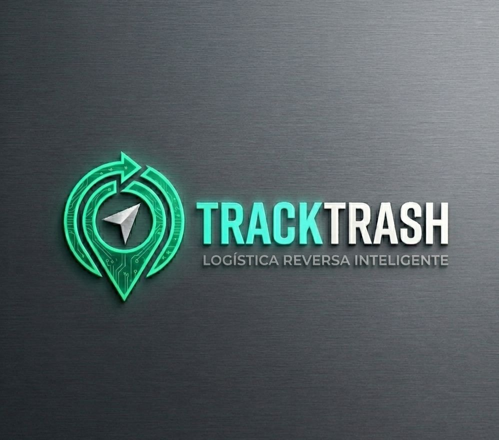



  
    

# 🌿 TrackTrash — Plataforma B2B de Logística de Resíduos Eletrônicos

> MVP desenvolvido para competição de Hackathon de Sustentabilidade

---

## 🚀 Demo ao Vivo

**[https://tracktrash-pitch.vercel.app/](https://tracktrash-pitch.vercel.app/)**

| Perfil | Email de Acesso | Senha |
|--------|-----------------|-------|
| 🏪 Lojista / Empresa | qualquer@email.com | qualquer |
| ⚙️ Administrador | admin@tracktrash.com | qualquer |

---

## 📋 Sobre o Projeto

O **TrackTrash** é uma plataforma B2B SaaS de gestão e logística de resíduos eletrônicos (e-waste) focada em:

- **Pequenas e Médias Empresas** — lojas de eletrônicos, assistências técnicas, escritórios
- **Descarte Correto** com rastreamento em tempo real por satélite
- **Certificado ESG Digital** para comprovação de conformidade ambiental
- **Otimização Logística por IA** para redução de emissões de CO₂

---

## 🏗️ Arquitetura do Sistema

### Dual-Role Platform

\\\
Login
  ├── Portal Lojista (B2B Client)
  │   ├── Dashboard (KPIs, métricas ESG)
  │   ├── Cadastro de Resíduos
  │   ├── Solicitação de Coleta
  │   ├── Acompanhamento de Status
  │   └── Histórico + Certificado ESG
  │
  └── Admin Dashboard (Operador TrackTrash)
      ├── Feed de Inteligência
      ├── SAT-INTEL (Mapa Leaflet/OpenStreetMap)
      ├── Otimização de Rotas (IA)
      └── Gestão de Frota
\\\

---

## 🛠️ Stack Tecnológica

| Tecnologia | Uso |
|------------|-----|
| **React 18 + Vite** | Framework front-end |
| **Leaflet.js + OpenStreetMap** | Mapa de rastreamento (100% gratuito) |
| **Lucide React** | Ícones premium |
| **CSS Glassmorphism** | Design System customizado |
| **Vercel** | Deploy e hospedagem |

---

## 📁 Estrutura do Projeto

\\\
PrototypeTrackTrash/
├── src/
│   ├── components/
│   │   ├── Login.jsx               # Tela 5.1 — Autenticação dual-role
│   │   ├── ClientPortal.jsx        # Telas 5.2–5.7 — Portal Lojista
│   │   └── AdminDashboard.jsx      # Dashboard Administrador + SAT-INTEL
│   ├── styles/
│   │   └── main.css                # Design System (Glassmorphism)
│   ├── App.jsx                     # Roteamento de perfis
│   └── main.jsx
├── tracktrash-deliverables.html    # Fluxograma + Wireframe + Protótipo
├── package.json
└── vite.config.js
\\\

---

## 📐 Entregáveis de Design

O arquivo **\	racktrash-deliverables.html\** contém os 3 entregáveis visuais do projeto:

- **Fluxograma** — Processos e tomadas de decisão para cada perfil
- **Wireframe** — Diagramação de 5 telas principais (navegável)
- **Protótipo Final** — Especificação completa das 8 telas do MVP

Abra localmente no navegador para explorar.

---

## ⚡ Como Rodar Localmente

\\\ash
# Instalar dependências
npm install

# Rodar em modo de desenvolvimento
npm run dev

# Build para produção
npm run build
\\\

---

## 🌎 Impacto Ambiental

| Métrica | Valor Projetado |
|---------|-----------------|
| Resíduos gerenciados/mês | 5.000 kg |
| CO₂ evitado/mês | ~3.600 kg |
| Empresas atendidas (meta Ano 1) | 200 PMEs |
| Certificados ESG gerados | 1 por coleta |

---

## 👥 Equipe — #338

Projeto desenvolvido para o **Hackathon de Sustentabilidade 2026**.

| Nome | Função | E-mail |
|------|--------|--------|
| Anna Beatriz Maya Lozi Melhorim | 🎨 Designer | annamaya@outlook.com |
| Jasmyne Cristina Barbosa Rodrigues | 💼 Gestora de Negócios | jasmynerodrigues007@gmail.com |
| Léo Matias Araújo | 💻 Desenvolvedor | leomatias@alu.ufc.br |
| Lucas Ricardo Paulino Cabral | ⚡ Otimizador de Fluxo | lucaspaulinocabral@gmail.com |
| Otto David de Santana Freitag | 🚀 Gestor de Negócios e Desenvolvedor | ottofreitag@uol.com.br |

---

*TrackTrash — Transformando e-waste em responsabilidade ESG* ♻️

---

## 🎤 Pitch Deck

> **Apresentação oficial da equipe #338 para o Hackathon 2026**

**[👉 Clique aqui para ver o Pitch Deck completo](https://manus.im/share/file/99471a60-f13f-45b7-b593-f0b20a7fd61a)**

